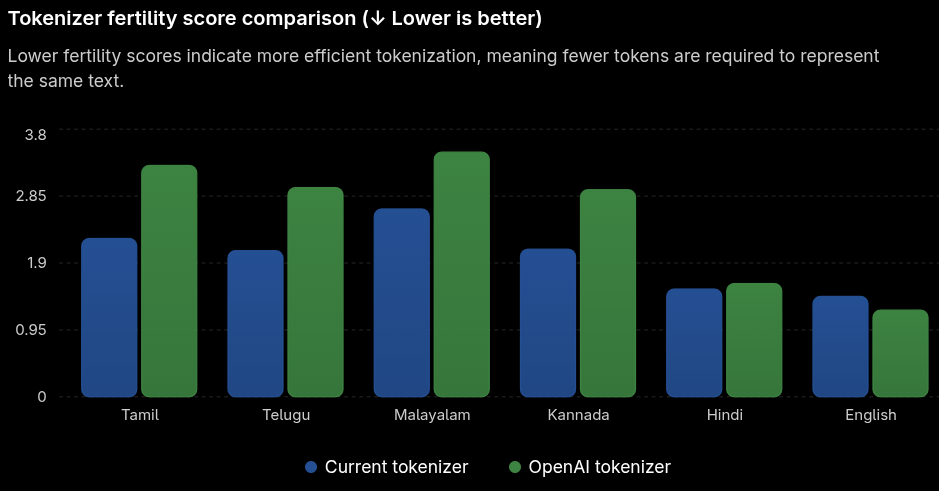

# Train Multilingual Unicode BPE Tokenizer with Hugging Face

A multilingual **Unicode-Level BPE Tokenizer** based on DeekseekV4 Regex built using the Hugging Face Tokenizers library.

## Training Config:

| | |
| ------------------------- | ---------------------------------- |
| **Dataset**               | `ai4bharat/IndicCorpV2`
| **Corpus Size**           | `18GB`
| **Languages**             | `ta`, `en`, `te`, `ml`, `hi`, `kn` |
| **Vocabulary Size**       | `64000`                            |
| **Pre-tokenization**      | Regex-based (DeepSeek V4 style)    |
| **Byte Fallback Support** | Yes                                |
| **RAM Consumed**          | `40 GB`                            |

## Training the Tokenizer:

### 1️⃣ Clone the Repo & Install `requirements.txt`

```bash
git clone https://github.com/harshitv804/Train-Multilingual-BPE-Tokenizer-with-HF.git
cd Train-Multilingual-BPE-Tokenizer-with-HF

pip install -r requirements.txt
```

### 2️⃣ Configure Training Parameters

Edit `config.py` and set the desired vocab size, minimum merge freq and special tokens:

### 3️⃣ Prepare Your Corpus

Create a folder named `corpus` in the project root:

```text
project/
├── corpus/
├── output/
├── config.py
├── trainer.py
└── ...
```

Copy all training data files into the `corpus` directory.

**Requirements:**
- Files must be in `.txt` format.
- You can include Tamil, English, or mixed-language text.
- Multiple text files are supported.

### 4️⃣ Start Training

Run:

```bash
python trainer.py
```

### 5️⃣ Training Output

After training completes, the tokenizer will be saved automatically to:

```text
output/tokenizer.json
```

## Example Directory Structure

```text
project/
├── corpus/
│   ├── ta.txt
│   ├── en.txt
│   └── mixed.txt
├── output/
│   └── tokenizer.json
├── config.py
├── trainer.py
└── README.md
```

## Fertility Score:


> 🤖 AI-assisted README.
